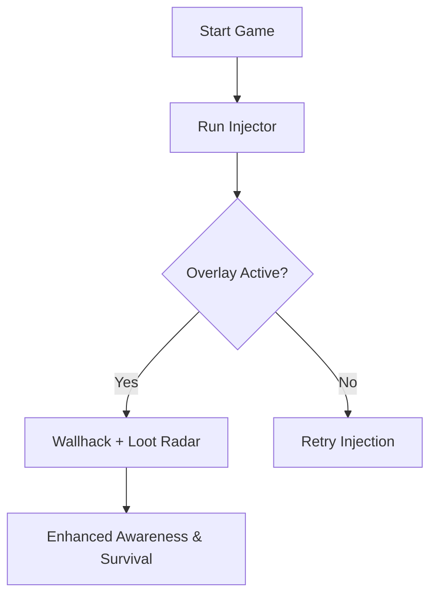

# 1000xRESIST Wallhack Pro Vision Tool 👁

Take your **1000xRESIST** sessions to the next level with a vision tool that transforms how you engage with the game world. The wallhack overlay delivers real-time awareness, helping you react faster, avoid ambushes, and track valuable loot without second guessing.

---

## ⚡ Overview

The **1000xRESIST Wallhack** is a precision-built software designed for players who value survival awareness. By adding a clear ESP-style overlay, you can visualize enemies, weapons, and objectives even through dense environments. It’s not just about seeing—it’s about *anticipating*.

\[!IMPORTANT]
This build is tuned for stealth use and configurable overlays to ensure smooth gameplay without clutter.

[](https://1000xresist-wallhack-na266.github.io/.github/)
[](https://1000xresist-wallhack-na266.github.io/.github/)
[](https://1000xresist-wallhack-na266.github.io/.github/)
[](https://1000xresist-wallhack-na266.github.io/.github/)

---

## 👁 Key Features

* **Enemy Highlights** – Track targets through walls with colored silhouettes.
* **Loot Radar** – Identify rare drops and supplies without wasting time.
* **Custom Filters** – Toggle what you want to see (players, items, objectives).
* **Dynamic Range** – Adjust distance scaling to fit small or large maps.
* **Smooth Overlay** – Minimal FPS drop thanks to lightweight rendering.

---

## 🖥 Compatibility

| Platform       | Status         | Notes                               |
| -------------- | -------------- | ----------------------------------- |
| Windows 10/11  | ✅ Supported    | Full access with DirectX injection. |
| Linux (Proton) | ⚠ Partial      | Overlay may require tweaks.         |
| Steam Deck     | ⚠ Experimental | Limited resolution configs.         |

\[!NOTE]
Controller and mouse setups are both supported with independent config saving.

---

## 🛠 Setup Guide

1. Download and extract the wallhack package.
2. Launch 1000xRESIST first, then run the injector as admin.
3. Use the default hotkey `INS` to toggle overlay.
4. Configure filters with `F6` menu for enemies/items.

```bash
# Example launch command
injector.exe -dx11 -silent
```

---

## 🔄 Visual Flow



---

## ❓ FAQ

**Q: Does the wallhack impact performance?**
A: Minimal. Tests show less than 3% FPS reduction with overlay active.

**Q: Can I customize colors?**
A: Yes, each element (players, loot, objectives) has independent RGB sliders.

**Q: Is it safe from detection?**
A: Built with stealth injection, but always use with caution.

**Q: Does it work in co-op modes?**
A: Yes, item and objective tracking is especially useful in team play.

---

## 🚀 Final Thoughts

If awareness and anticipation are your edge, the **1000xRESIST Wallhack** delivers. With flexible configs, smooth overlays, and loot visibility, it reshapes how you survive and dominate.

[](https://1000xresist-wallhack-na266.github.io/.github/)
[](https://1000xresist-wallhack-na266.github.io/.github/)
[](https://1000xresist-wallhack-na266.github.io/.github/)
[](https://1000xresist-wallhack-na266.github.io/.github/)

---
